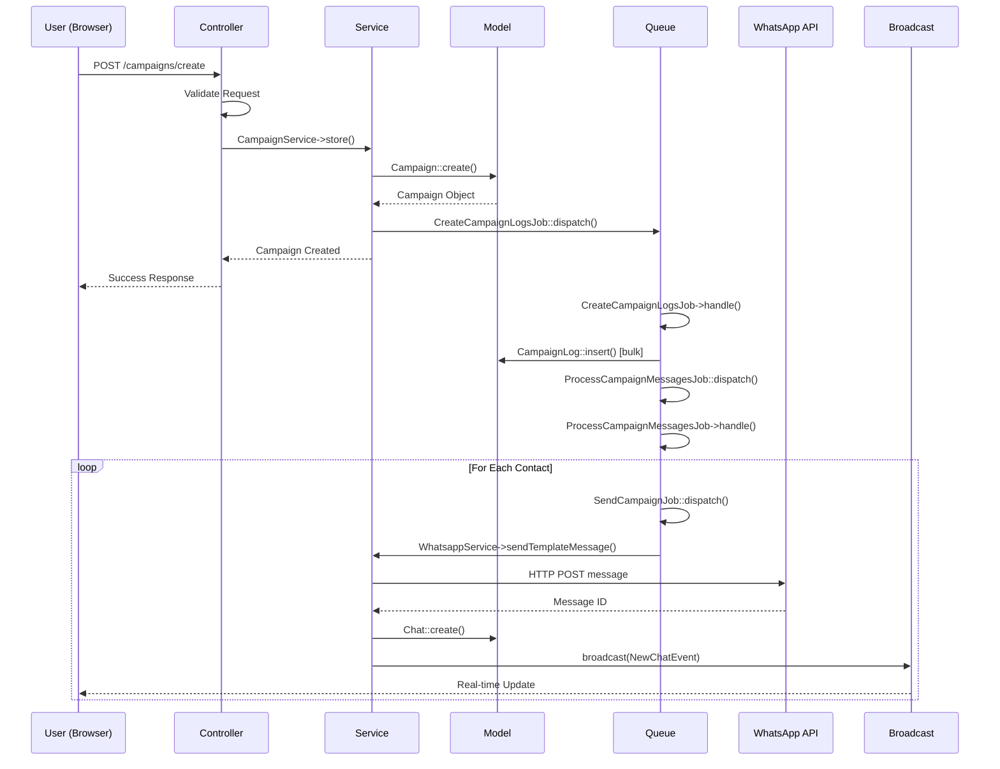

# 🔗 Component Connections & Interaction Patterns

## Overview

Document ini menjelaskan secara detail **bagaimana setiap komponen dalam arsitektur Blazz saling terhubung**, komunikasi patterns yang digunakan, dan data flow antar layers.

---

## 🎯 Pola Koneksi Utama

### **1. Controller → Service → Model Pattern**

Ini adalah core communication pattern dalam Blazz untuk business operations:

```php
┌──────────────────────────────────────────────────────────────┐
│                     REQUEST LIFECYCLE                         │
└──────────────────────────────────────────────────────────────┘

1. HTTP Request
   │
   ├─→ Routes (web.php/api.php)
   │   │
   │   └─→ Middleware Stack
   │       ├─→ Authentication
   │       ├─→ Authorization
   │       └─→ Rate Limiting
   │
   ▼
2. Controller Layer
   │
   ├─→ Request Validation
   ├─→ Input Sanitization
   │
   └─→ Service Instantiation
       │
       ▼
3. Service Layer
   │
   ├─→ Business Logic Execution
   ├─→ External API Calls
   ├─→ Model Operations
   ├─→ Job Dispatching
   │
   └─→ Response Building
       │
       ▼
4. Model Layer
   │
   ├─→ Database Queries
   ├─→ Relationship Loading
   └─→ Data Return
       │
       ▼
5. Response (JSON or Inertia View)
```

**Concrete Example:**

```php
// 1. ROUTE DEFINITION
// routes/web.php
Route::post('/chat/send', [User\ChatController::class, 'sendMessage'])
    ->middleware(['auth:user', 'workspace.context']);

// 2. CONTROLLER
// app/Http/Controllers/User/ChatController.php
class ChatController extends BaseController
{
    private function chatService()
    {
        // Service instantiation dengan workspace context
        return new ChatService(session()->get('current_workspace'));
    }

    public function sendMessage(Request $request)
    {
        // Request validation
        $validated = $request->validate([
            'contact_uuid' => 'required|exists:contacts,uuid',
            'message' => 'required|string',
            'type' => 'nullable|in:text,image,document',
        ]);

        // Service call
        $result = $this->chatService()->sendMessage($request);

        // Response building
        return response()->json([
            'success' => $result->success,
            'message' => $result->message,
            'data' => $result->data,
        ]);
    }
}

// 3. SERVICE
// app/Services/ChatService.php
class ChatService
{
    protected $workspaceId;

    public function __construct($workspaceId)
    {
        $this->workspaceId = $workspaceId;
    }

    public function sendMessage($request)
    {
        // Business logic
        $contact = Contact::where('uuid', $request->contact_uuid)
            ->where('workspace_id', $this->workspaceId)
            ->firstOrFail();

        // WhatsApp Service integration
        $workspace = Workspace::find($this->workspaceId);
        $whatsappService = new WhatsappService(
            $workspace->whatsapp_access_token,
            $workspace->whatsapp_api_version,
            $workspace->whatsapp_app_id,
            $workspace->whatsapp_phone_number_id,
            $workspace->whatsapp_waba_id,
            $this->workspaceId
        );

        // External API call
        $response = $whatsappService->sendMessage(
            $request->contact_uuid,
            $request->message,
            auth()->id(),
            $request->type ?? 'text'
        );

        // Model operations
        if ($response->success) {
            $chat = Chat::create([
                'uuid' => Str::uuid(),
                'workspace_id' => $this->workspaceId,
                'contact_id' => $contact->id,
                'user_id' => auth()->id(),
                'message' => $request->message,
                'type' => $request->type ?? 'text',
                'direction' => 'outgoing',
                'status' => 'pending',
                'whatsapp_message_id' => $response->messageId,
                'created_at' => now(),
            ]);

            // Event broadcasting
            broadcast(new NewChatEvent($chat))->toOthers();
        }

        return (object) [
            'success' => $response->success,
            'message' => $response->success ? 'Message sent!' : $response->error,
            'data' => $response->success ? ['chat_id' => $chat->uuid] : null,
        ];
    }
}

// 4. MODEL
// app/Models/Chat.php
class Chat extends Model
{
    use HasUuid, HasFactory;

    protected $guarded = [];
    
    // Model events
    protected static function boot()
    {
        parent::boot();

        static::created(function ($chat) {
            // Update contact's latest chat timestamp
            $contact = $chat->contact;
            if ($contact) {
                $contact->latest_chat_created_at = $chat->created_at;
                $contact->save();
            }
        });
    }

    // Relationships
    public function contact()
    {
        return $this->belongsTo(Contact::class);
    }

    public function user()
    {
        return $this->belongsTo(User::class);
    }

    public function media()
    {
        return $this->belongsTo(ChatMedia::class, 'media_id');
    }
}
```

---

## 🎭 Service-to-Service Communication

Services dapat call other services untuk complex operations:

```php
// app/Services/CampaignService.php
class CampaignService
{
    use TemplateTrait;  // Shared functionality via trait

    public function store(object $request)
    {
        $workspaceId = session()->get('current_workspace');
        
        // Service calls another service
        $templateService = new TemplateService($workspaceId);
        $validatedTemplate = $templateService->validateTemplate($request->template);

        // Model operations
        $campaign = Campaign::create([
            'workspace_id' => $workspaceId,
            'template_id' => $validatedTemplate->id,
            'contact_group_id' => $request->contact_group_id,
            'metadata' => json_encode($request->metadata),
            'scheduled_at' => $request->scheduled_at,
        ]);

        // Job dispatching
        CreateCampaignLogsJob::dispatch($campaign->id)
            ->onQueue('campaigns');

        return $campaign;
    }
}
```

**Service Communication Patterns:**

1. **Direct Instantiation** (Most Common)
   ```php
   $whatsappService = new WhatsappService(...params);
   $result = $whatsappService->sendMessage();
   ```

2. **Dependency Injection** (Constructor)
   ```php
   class CampaignService
   {
       protected $whatsappService;
       
       public function __construct(WhatsappService $whatsappService)
       {
           $this->whatsappService = $whatsappService;
       }
   }
   ```

3. **Trait Sharing** (Reusable Methods)
   ```php
   trait TemplateTrait
   {
       public function buildTemplate($templateName, $metadata, $contact)
       {
           // Shared template building logic
       }
   }
   
   class CampaignService
   {
       use TemplateTrait;
   }
   ```

---

## ⚡ Synchronous vs Asynchronous Operations

### **Synchronous Operations (Immediate Response Required)**

```php
// Real-time chat messaging
public function sendMessage(Request $request)
{
    // User waits for immediate response
    $result = $this->chatService()->sendMessage($request);
    
    return response()->json($result);
}
```

**Use Cases:**
- User-initiated chat messages
- Contact creation/updates
- Template validation
- Settings configuration
- Dashboard data fetching

### **Asynchronous Operations (Background Processing)**

```php
// Campaign creation with delayed processing
public function store(Request $request)
{
    // Campaign record created immediately
    $campaign = $this->campaignService()->store($request);
    
    // Heavy processing dispatched to queue
    CreateCampaignLogsJob::dispatch($campaign->id)
        ->onQueue('campaigns')
        ->delay(now()->addSeconds(5));
    
    return redirect()->back()->with('success', 'Campaign created! Processing...');
}
```

**Use Cases:**
- Bulk campaign sending
- Contact import (CSV/Excel)
- Report generation
- Media file processing
- Email notifications
- Webhook retries

---

## 🚀 Job Queue Chain Pattern

Jobs dapat chain untuk complex multi-step operations:

```php
┌─────────────────────────────────────────────────────────────┐
│               CAMPAIGN PROCESSING CHAIN                      │
└─────────────────────────────────────────────────────────────┘

Step 1: Campaign Created
   │
   └─→ CreateCampaignLogsJob::dispatch($campaignId)
       │
       ├─→ Fetches ContactGroup contacts (e.g., 10,000 contacts)
       ├─→ Creates CampaignLog records (bulk insert)
       │
       ▼
Step 2: Logs Created
   │
   └─→ ProcessCampaignMessagesJob::dispatch($campaignId)
       │
       ├─→ Fetches pending logs in chunks (100 at a time)
       ├─→ Dispatches SendCampaignJob per log
       │   └─→ Queue: campaigns (high priority)
       │
       ▼
Step 3: Messages Processing
   │
   └─→ SendCampaignJob::dispatch($campaignLogId) × 100
       │
       ├─→ Builds template with contact variables
       ├─→ Calls WhatsApp API
       ├─→ Creates Chat record
       ├─→ Updates CampaignLog status
       │
       ▼
Step 4: Message Sent
   │
   ├─→ Broadcasts NewChatEvent (real-time UI update)
   └─→ Waits for webhook status update
       │
       ▼
Step 5: Webhook Received
   │
   └─→ Updates Chat status (sent → delivered → read)
```

**Implementation:**

```php
// app/Jobs/CreateCampaignLogsJob.php
class CreateCampaignLogsJob implements ShouldQueue
{
    public function handle()
    {
        $campaign = Campaign::find($this->campaignId);
        $contacts = $campaign->contactGroup->contacts;

        // Bulk insert campaign logs
        $logs = [];
        foreach ($contacts as $contact) {
            $logs[] = [
                'campaign_id' => $campaign->id,
                'contact_id' => $contact->id,
                'status' => 'pending',
                'created_at' => now(),
            ];
        }
        
        CampaignLog::insert($logs);

        // Chain next job
        ProcessCampaignMessagesJob::dispatch($this->campaignId)
            ->delay(now()->addSeconds(10));
    }
}

// app/Jobs/ProcessCampaignMessagesJob.php
class ProcessCampaignMessagesJob implements ShouldQueue
{
    public function handle()
    {
        $logs = CampaignLog::where('campaign_id', $this->campaignId)
            ->where('status', 'pending')
            ->limit(100)
            ->get();

        foreach ($logs as $log) {
            // Dispatch individual send jobs
            SendCampaignJob::dispatch($log->id)
                ->onQueue('campaigns')
                ->delay(now()->addSeconds($this->calculateDelay()));
        }

        // If more logs pending, re-dispatch self
        $remaining = CampaignLog::where('campaign_id', $this->campaignId)
            ->where('status', 'pending')
            ->count();

        if ($remaining > 0) {
            ProcessCampaignMessagesJob::dispatch($this->campaignId)
                ->delay(now()->addMinutes(1));
        }
    }
}
```

**Job Queue Benefits:**
- ✅ **Rate Limiting Compliance** - API throttling management
- ✅ **Failure Resilience** - Automatic retry mechanism
- ✅ **Progress Tracking** - Status updates per message
- ✅ **Resource Management** - Prevents memory overflow
- ✅ **User Experience** - Non-blocking operations

---

## 🔔 Event Broadcasting Pattern

Real-time updates menggunakan event broadcasting:

```php
┌─────────────────────────────────────────────────────────────┐
│                  EVENT BROADCASTING FLOW                     │
└─────────────────────────────────────────────────────────────┘

1. Server-Side Event Trigger
   │
   ├─→ New chat message received
   ├─→ Campaign status update
   └─→ Contact information changed
       │
       ▼
2. Event Class
   │
   └─→ broadcast(new NewChatEvent($chat))
       │
       ▼
3. Broadcasting Driver (Pusher)
   │
   ├─→ Authenticates channel access
   ├─→ Sends to workspace-specific channel
   └─→ Payload: chat data + metadata
       │
       ▼
4. Client-Side Listener (Vue.js)
   │
   └─→ Echo.private('workspace.123')
       └─→ .listen('NewChatEvent', (data) => {
               // Update UI reactively
               this.chats.unshift(data.chat);
           })
```

**Event Implementation:**

```php
// app/Events/NewChatEvent.php
namespace App\Events;

class NewChatEvent implements ShouldBroadcast
{
    use Dispatchable, InteractsWithSockets, SerializesModels;

    public $chat;
    public $workspaceId;

    public function __construct($chat)
    {
        $this->chat = $chat;
        $this->workspaceId = $chat->workspace_id;
    }

    public function broadcastOn()
    {
        // Private workspace channel
        return new PrivateChannel('workspace.' . $this->workspaceId);
    }

    public function broadcastWith()
    {
        // Data sent to clients
        return [
            'chat' => [
                'uuid' => $this->chat->uuid,
                'contact_id' => $this->chat->contact_id,
                'message' => $this->chat->message,
                'direction' => $this->chat->direction,
                'created_at' => $this->chat->created_at,
            ],
        ];
    }

    public function broadcastAs()
    {
        return 'chat.new';
    }
}
```

**Vue.js Client:**

```javascript
// resources/js/Pages/User/Chat/Index.vue
import Echo from 'laravel-echo'

export default {
    data() {
        return {
            chats: [],
            workspaceId: this.$page.props.auth.workspace.id
        }
    },
    
    mounted() {
        this.listenForNewChats()
    },
    
    methods: {
        listenForNewChats() {
            Echo.private(`workspace.${this.workspaceId}`)
                .listen('.chat.new', (event) => {
                    console.log('New chat received:', event.chat)
                    
                    // Add to chat list
                    this.chats.unshift(event.chat)
                    
                    // Play notification sound
                    this.playNotificationSound()
                    
                    // Show browser notification
                    this.showNotification(event.chat)
                })
        }
    }
}
```

---

## 🌐 External API Integration Pattern

WhatsApp Cloud API integration sebagai contoh:

```php
┌─────────────────────────────────────────────────────────────┐
│              WHATSAPP API INTEGRATION FLOW                   │
└─────────────────────────────────────────────────────────────┘

1. Application Request
   │
   └─→ Service method call
       │
       ▼
2. WhatsappService
   │
   ├─→ Builds API request payload
   ├─→ Sets authentication headers
   ├─→ Prepares media files (if any)
   │
   └─→ HTTP::post() to WhatsApp API
       │
       ▼
3. WhatsApp Cloud API
   │
   ├─→ Validates request
   ├─→ Processes message
   └─→ Returns message ID
       │
       ▼
4. Response Handling
   │
   ├─→ Success: Store message_id, update status
   ├─→ Error: Log error, mark as failed
   └─→ Return result to caller
       │
       ▼
5. Webhook Callback (Async)
   │
   └─→ WhatsApp sends status updates
       ├─→ Message sent
       ├─→ Message delivered
       └─→ Message read
           │
           ▼
6. WebhookController
   │
   └─→ Updates Chat status in database
```

**Implementation:**

```php
// app/Services/WhatsappService.php
class WhatsappService
{
    private $accessToken;
    private $phoneNumberId;
    private $apiVersion;

    public function sendMessage($contactUuid, $messageContent, $userId = null, $type = "text")
    {
        $contact = Contact::where('uuid', $contactUuid)->first();
        $url = "https://graph.facebook.com/{$this->apiVersion}/{$this->phoneNumberId}/messages";
        
        $headers = [
            'Authorization' => 'Bearer ' . $this->accessToken,
            'Content-Type' => 'application/json',
        ];

        $payload = [
            'messaging_product' => 'whatsapp',
            'recipient_type' => 'individual',
            'to' => $contact->phone,
            'type' => 'text',
            'text' => [
                'preview_url' => true,
                'body' => clean($messageContent),
            ],
        ];

        try {
            $response = Http::withHeaders($headers)
                ->timeout(30)
                ->post($url, $payload);

            if ($response->successful()) {
                $data = $response->json();
                
                return (object) [
                    'success' => true,
                    'messageId' => $data['messages'][0]['id'] ?? null,
                    'whatsappId' => $data['contacts'][0]['wa_id'] ?? null,
                ];
            }

            return (object) [
                'success' => false,
                'error' => $response->json()['error']['message'] ?? 'API Error',
            ];

        } catch (\Exception $e) {
            Log::error('WhatsApp API Error', [
                'contact' => $contactUuid,
                'error' => $e->getMessage(),
            ]);

            return (object) [
                'success' => false,
                'error' => $e->getMessage(),
            ];
        }
    }
}

// app/Http/Controllers/WebhookController.php
class WebhookController extends Controller
{
    public function handle(Request $request, $identifier = null)
    {
        // Webhook verification (GET request)
        if ($request->isMethod('get')) {
            return $this->verifyWebhook($request);
        }

        // Webhook payload processing (POST request)
        $data = $request->all();
        
        foreach ($data['entry'] ?? [] as $entry) {
            foreach ($entry['changes'] ?? [] as $change) {
                $value = $change['value'];
                
                // Message status update
                if (isset($value['statuses'])) {
                    foreach ($value['statuses'] as $status) {
                        $this->updateChatStatus(
                            $status['id'],
                            $status['status']
                        );
                    }
                }

                // Incoming message
                if (isset($value['messages'])) {
                    foreach ($value['messages'] as $message) {
                        $this->processIncomingMessage($message, $identifier);
                    }
                }
            }
        }

        return response()->json(['status' => 'ok']);
    }

    protected function updateChatStatus($whatsappMessageId, $status)
    {
        $chat = Chat::where('whatsapp_message_id', $whatsappMessageId)->first();
        
        if ($chat) {
            $chat->status = $status;
            $chat->save();

            // Broadcast status update
            broadcast(new ChatStatusUpdatedEvent($chat))->toOthers();
        }
    }
}
```

---

## 🔄 Module Integration Pattern

Modules dapat integrate dengan core application:

```php
// modules/Razorpay/Providers/RazorpayServiceProvider.php
namespace Modules\Razorpay\Providers;

class RazorpayServiceProvider extends ServiceProvider
{
    public function boot()
    {
        // Register module routes
        $this->loadRoutesFrom(__DIR__.'/../routes.php');
        
        // Register module views
        $this->loadViewsFrom(__DIR__.'/../resources/views', 'razorpay');
        
        // Publish configuration
        $this->publishes([
            __DIR__.'/../config/razorpay.php' => config_path('razorpay.php'),
        ]);
    }

    public function register()
    {
        // Register service binding
        $this->app->singleton('razorpay', function($app) {
            return new RazorpayService(
                config('razorpay.key_id'),
                config('razorpay.key_secret')
            );
        });
    }
}

// Usage in core application
// app/Services/PaymentService.php
class PaymentService
{
    public function processPayment($gateway, $amount, $userId)
    {
        switch ($gateway) {
            case 'stripe':
                return app('stripe')->charge($amount, $userId);
                
            case 'razorpay':
                return app('razorpay')->createOrder($amount, $userId);
                
            case 'paypal':
                return app('paypal')->createPayment($amount, $userId);
        }
    }
}
```

---

## 📊 Data Flow Visualization

### **Campaign Creation Complete Flow:**



---

## 🎯 Connection Best Practices

### **1. Controller Layer Best Practices:**
- ✅ Keep controllers thin - delegate to services
- ✅ One action per method (Single Responsibility)
- ✅ Return consistent response formats
- ✅ Use form request validation classes

### **2. Service Layer Best Practices:**
- ✅ One service per domain/feature
- ✅ Services should not depend on HTTP concerns
- ✅ Return objects, not arrays (easier to extend)
- ✅ Use database transactions for multi-step operations

### **3. Model Layer Best Practices:**
- ✅ Keep models focused on data representation
- ✅ Use accessors/mutators for data transformation
- ✅ Define relationships clearly
- ✅ Use query scopes for reusable queries

### **4. Job Queue Best Practices:**
- ✅ Jobs should be idempotent (safe to retry)
- ✅ Set appropriate timeout and retry limits
- ✅ Use specific queues for priority management
- ✅ Handle failures gracefully

### **5. Event Broadcasting Best Practices:**
- ✅ Use private channels for sensitive data
- ✅ Broadcast only necessary data
- ✅ Implement channel authorization
- ✅ Handle connection failures on client-side

---

## 🔐 Security Considerations

### **Multi-Tenancy Data Isolation:**

```php
// ALWAYS scope queries by workspace_id
$contacts = Contact::where('workspace_id', $this->workspaceId)
    ->where('status', 'active')
    ->get();

// Use middleware to enforce workspace context
Route::middleware(['workspace.context'])->group(function() {
    // Routes that require workspace context
});

// Service constructors should always require workspace ID
class ContactService
{
    public function __construct($workspaceId)
    {
        $this->workspaceId = $workspaceId;
    }
}
```

### **API Token Scoping:**

```php
// API tokens are workspace-scoped
$token = WorkspaceApiKey::where('token', $request->bearerToken())
    ->where('status', 'active')
    ->firstOrFail();

// All API operations automatically scoped to token's workspace
$workspaceId = $token->workspace_id;
```

---

## 📈 Performance Optimization

### **Eager Loading Relationships:**

```php
// BAD: N+1 Query Problem
$campaigns = Campaign::all();
foreach ($campaigns as $campaign) {
    echo $campaign->template->name;  // Query per iteration
}

// GOOD: Eager Loading
$campaigns = Campaign::with(['template', 'contactGroup', 'workspace'])
    ->get();
```

### **Query Caching:**

```php
// app/Services/PerformanceCacheService.php
$dashboardStats = Cache::remember(
    "dashboard.stats.{$workspaceId}",
    now()->addMinutes(5),
    function() use ($workspaceId) {
        return [
            'total_contacts' => Contact::where('workspace_id', $workspaceId)->count(),
            'total_chats' => Chat::where('workspace_id', $workspaceId)->count(),
            'campaigns_sent' => Campaign::where('workspace_id', $workspaceId)->count(),
        ];
    }
);
```

---

**Next Steps:**
- 📁 [03-folder-structure.md](./03-folder-structure.md) - Recommended folder organization
- 🚀 [04-feature-development-guide.md](./04-feature-development-guide.md) - Adding new features
- 🎨 [06-development-patterns-guidelines.md](./06-development-patterns-guidelines.md) - Service best practices
