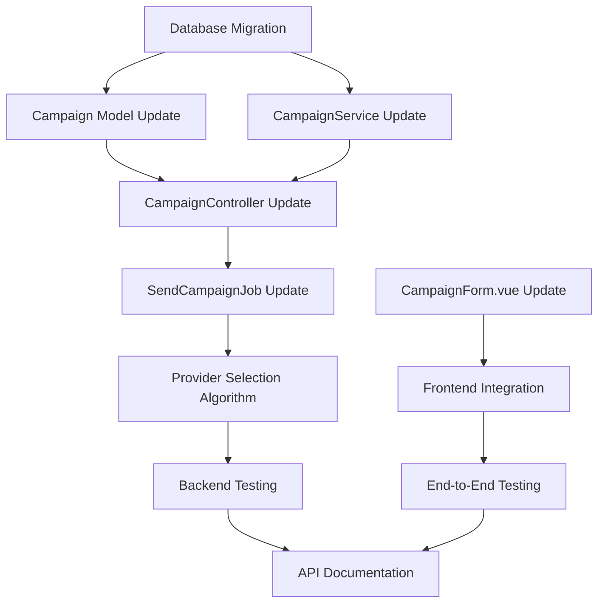

# Hybrid Campaign System - Implementation Tasks

## Overview

Document ini berisi daftar lengkap task yang diperlukan untuk mengimplementasikan Hybrid Campaign System yang memungkinkan pengguna membuat campaign dengan dua cara:
1. **Template-based** - Menggunakan template yang sudah ada
2. **Direct Message** - Input pesan langsung tanpa template

Dengan WhatsApp Web JS sebagai provider utama dan Meta API sebagai fallback.

## Task Categories

### ✅ Phase 1: Analysis & Documentation (COMPLETED)

#### 1.1 System Analysis
- [x] **Analyze existing campaign system architecture and flow**
  - Analisis arsitektur sistem campaign yang ada
  - Pemahaman flow dari creation hingga sending
  - Identifikasi komponen yang perlu di-modifikasi

#### 1.2 Design & Architecture
- [x] **Design hybrid campaign creation approach**
  - Rancang pendekatan hybrid campaign
  - Definisikan template vs direct message mode
  - Integrasi dengan provider selection algorithm
  - WhatsApp Web JS sebagai default utama

#### 1.3 Compliance Review
- [x] **Ensure compliance with development patterns**
  - Review dan pastikan kepatuhan dengan `docs/architecture/07-development-patterns-guidelines.md`
  - Follow existing patterns di codebase
  - Maintain consistency dengan existing architecture

#### 1.4 Documentation
- [x] **Create comprehensive broadcast system documentation**
  - `docs/broadcast/README.md` - System overview
  - `docs/broadcast/hybrid-campaign-guide.md` - Hybrid campaign guide
  - `docs/broadcast/provider-selection-algorithm.md` - Provider selection logic
  - `docs/broadcast/whatsapp-session-management.md` - Session management

---

### 🔄 Phase 2: Backend Implementation

#### 2.1 Database Layer
- [ ] **Add database migration for new campaign fields if needed**
  ```php
  // Fields to consider:
  - campaign_type (enum: 'template', 'direct')
  - message_content (text, for direct messages)
  - header_type, header_text, header_media (for direct messages)
  - body_text (for direct messages)
  - footer_text (for direct messages)
  - buttons_data (json, for direct messages)
  ```
  - **File**: `database/migrations/YYYY_MM_DD_HHMMSS_add_hybrid_campaign_fields_to_campaigns_table.php`
  - **Priority**: High
  - **Estimated Time**: 2 hours

#### 2.2 Model Layer
- [ ] **Update Campaign Model for hybrid support**
  - Tambahkan fillable fields untuk direct message
  - Update casts untuk new fields
  - Add accessors untuk message content (template vs direct)
  - Update validation rules
  - **File**: `app/Models/Campaign.php`
  - **Priority**: High
  - **Estimated Time**: 1.5 hours

- [ ] **Update CampaignService for both modes**
  - Modify createCampaign method untuk handle both template dan direct
  - Implement message content resolver
  - Update campaign processing logic
  - **File**: `app/Services/CampaignService.php`
  - **Priority**: High
  - **Estimated Time**: 3 hours

#### 2.3 Controller Layer
- [ ] **Update CampaignController to support direct message mode**
  - Add validation rules untuk direct message mode
  - Update store method untuk handle campaign_type
  - Add form request validation jika needed
  - **File**: `app/Http/Controllers/User/CampaignController.php`
  - **Priority**: High
  - **Estimated Time**: 2.5 hours

#### 2.4 Job Processing
- [ ] **Update SendCampaignJob for hybrid processing**
  - Modify job untuk resolve message content dari template atau direct
  - Update provider selection algorithm
  - Maintain backward compatibility
  - **File**: `app/Jobs/SendCampaignJob.php`
  - **Priority**: Medium
  - **Estimated Time**: 2 hours

- [ ] **Implement provider selection algorithm with WebJS priority**
  - Implement provider scoring algorithm
  - WhatsApp Web JS sebagai primary provider
  - Meta API sebagai fallback
  - Health monitoring integration
  - **File**: `app/Services/WhatsApp/ProviderSelectionService.php`
  - **Priority**: Medium
  - **Estimated Time**: 4 hours

#### 2.5 Validation Layer
- [ ] **Update campaign validation rules for direct message mode**
  - Create HybridCampaignRequest form request
  - Add validation untuk template fields
  - Add validation untuk direct message fields
  - **File**: `app/Http/Requests/HybridCampaignRequest.php`
  - **Priority**: Medium
  - **Estimated Time**: 1.5 hours

---

### 🔄 Phase 3: Frontend Implementation

#### 3.1 Vue Components
- [ ] **Modify CampaignForm.vue for hybrid template/direct message UI**
  - Add campaign type selector (template vs direct)
  - Conditional rendering berdasarkan type
  - Template selection dropdown
  - Direct message form (header, body, footer, buttons)
  - Maintain existing functionality
  - **File**: `resources/js/Components/CampaignForm.vue`
  - **Priority**: High
  - **Estimated Time**: 6 hours

- [ ] **Update Campaign validation di frontend**
  - Add form validation untuk direct message mode
  - Update error handling
  - Maintain template validation
  - **File**: `resources/js/Components/CampaignForm.vue`
  - **Priority**: Medium
  - **Estimated Time**: 2 hours

#### 3.2 Page Components
- [ ] **Update campaign creation page**
  - Ensure proper integration dengan CampaignForm
  - Update route handling jika needed
  - Test navigation dan flow
  - **File**: `resources/js/Pages/User/Campaigns/Create.vue`
  - **Priority**: Low
  - **Estimated Time**: 1 hour

---

### 🔄 Phase 4: Integration & Testing

#### 4.1 Unit Testing
- [ ] **Write unit tests for hybrid campaign creation**
  - Test CampaignService methods
  - Test model relationships dan accessors
  - Test validation rules
  - **Files**: `tests/Unit/CampaignServiceTest.php`, `tests/Unit/CampaignTest.php`
  - **Priority**: Medium
  - **Estimated Time**: 4 hours

#### 4.2 Feature Testing
- [ ] **Write feature tests for hybrid campaign flow**
  - Test campaign creation via API
  - Test provider selection
  - Test message processing
  - **File**: `tests/Feature/HybridCampaignTest.php`
  - **Priority**: Medium
  - **Estimated Time**: 3 hours

#### 4.3 End-to-End Testing
- [ ] **Test hybrid campaign creation flow end-to-end**
  - Test complete flow dari UI hingga message sending
  - Test kedua modes (template & direct)
  - Test provider switching
  - **Priority**: High
  - **Estimated Time**: 3 hours

---

### 🔄 Phase 5: Documentation & Deployment

#### 5.1 API Documentation
- [ ] **Update API documentation for hybrid campaign endpoints**
  - Update endpoint documentation
  - Add request/response examples untuk direct mode
  - Update Postman collection jika ada
  - **File**: `docs/api/campaigns.md`
  - **Priority**: Low
  - **Estimated Time**: 2 hours

#### 5.2 User Documentation
- [ ] **Update user guide for hybrid campaigns**
  - Add user documentation untuk new features
  - Create tutorial jika needed
  - **File**: `docs/user-guide/hybrid-campaigns.md`
  - **Priority**: Low
  - **Estimated Time**: 1.5 hours

---

## Task Dependencies



## Priority Matrix

| Priority | Tasks | Focus Area |
|----------|-------|------------|
| **High** | Database Migration, Model/Controller Updates, Frontend Form | Core functionality |
| **Medium** | Job Processing, Validation, Testing | Reliability & Quality |
| **Low** | Documentation, User Guides | Support & Maintenance |

## Timeline Estimates

- **Phase 2 (Backend)**: 16-20 hours
- **Phase 3 (Frontend)**: 8-10 hours
- **Phase 4 (Testing)**: 10-12 hours
- **Phase 5 (Documentation)**: 3-4 hours

**Total Estimated Time**: 37-46 hours

## Acceptance Criteria

### Must-Have Features:
1. ✅ Users can create campaigns using existing templates
2. ✅ Users can create campaigns with direct message input
3. ✅ WhatsApp Web JS prioritized over Meta API
4. ✅ Existing template functionality remains intact
5. ✅ Provider selection works with health scoring
6. ✅ Message variable replacement works for both modes

### Performance Requirements:
- Campaign creation response time < 2 seconds
- Provider selection decision < 500ms
- Form validation response time < 1 second

### Compatibility Requirements:
- Maintain backward compatibility dengan existing campaigns
- No breaking changes untuk existing API endpoints
- All existing templates continue to work

## Risk Mitigation

| Risk | Impact | Mitigation |
|------|--------|------------|
| Database migration fails | High | Backup database, test migration di staging |
| Provider selection issues | Medium | Implement fallback logic, extensive testing |
| Frontend complexity | Medium | Iterative development, user testing |
| Performance degradation | Medium | Load testing, optimize queries |

## Next Steps

1. **Immediate Start**: Database migration dan model updates
2. **Parallel Development**: Frontend form dapat dimulai setelah backend API selesai
3. **Continuous Testing**: Unit tests untuk setiap component yang selesai
4. **Regular Reviews**: Code review setiap phase selesai

---

*Last Updated: 2025-11-14*
*Version: 1.0*