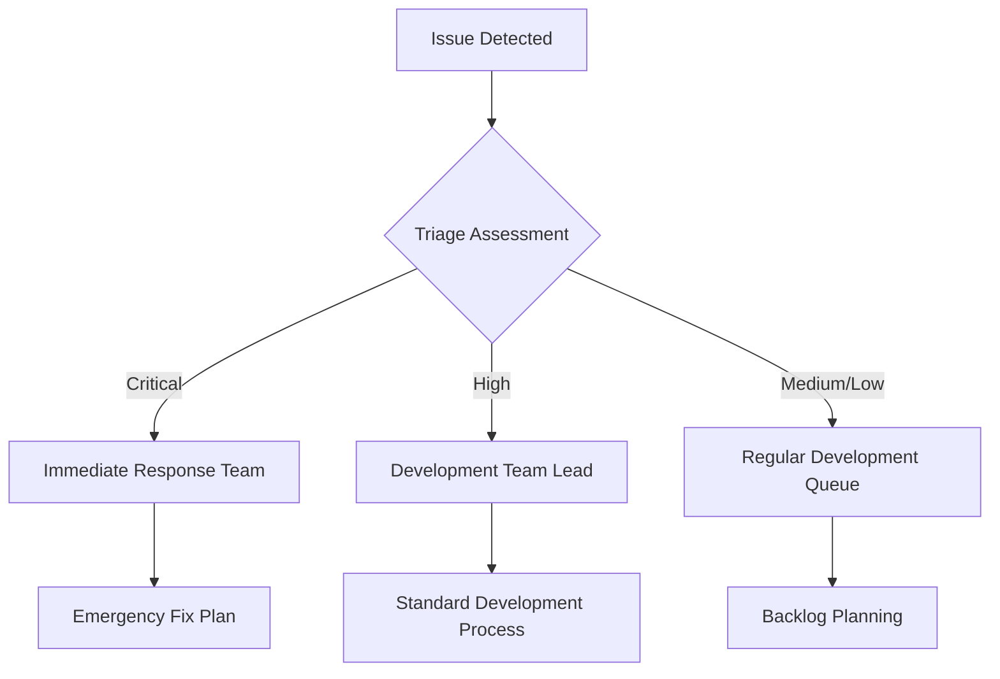

# 🚨 03-Issues Documentation

## 🎯 Purpose
Kategori ini mendokumentasikan issue tracking, bug reports, dan problem solving untuk Blazz Chat System.

## 📚 Document Index

### **Critical Issues** ([`./critical/`](./critical/))
#### **[01-chat-cross-contamination-tracker.md](./critical/01-chat-cross-contamination-tracker.md)**
- **Issue ID:** CHAT-001
- **Severity:** Critical - Core Functionality
- **Status:** Analysis Complete, Fix Required
- **Description:** Chats from multiple WhatsApp accounts displayed together without proper isolation
- **Priority:** P0 - Immediate Fix Required
- **Document Type:** Issue tracker with task breakdown

#### **[02-whatsapp-account-isolation-implementation.md](./critical/02-whatsapp-account-isolation-implementation.md)**
- **Issue ID:** CHAT-001-IMPL
- **Status:** Implementation Plan Complete
- **Description:** Complete implementation guide for WhatsApp account isolation
- **Features:** Backend fixes, frontend enhancement, testing strategy
- **Document Type:** Technical implementation guide

#### **[03-chat-isolation-quick-fix.md](./critical/03-chat-isolation-quick-fix.md)**
- **Issue ID:** CHAT-001-QUICKFIX
- **Status:** Ready for Deployment
- **Description:** Emergency fix for immediate deployment (30 minutes)
- **Features:** Backend only fixes, rollback plan, verification
- **Document Type:** Emergency deployment guide

### **Performance Issues** ([`./performance/`](./performance/))
#### **[01-infinite-scroll-bug-fix.md](./performance/01-infinite-scroll-bug-fix.md)**
- **Issue ID:** PERF-001
- **Status:** Complete
- **Description:** Infinite scroll performance issues and bug fixes
- **Solution:** Optimized query performance, UI enhancements
- **Document Type:** Bug fix documentation

---

## 🔥 Active Critical Issues

### **CHAT-001: WhatsApp Account Cross-Contamination**
- **🚨 Status:** **IMMEDIATE ACTION REQUIRED**
- **📊 Impact:** High - User confusion, data integrity issues
- **⏱️ Timeline:** Fix within 7 days
- **👥 Assignee:** Development Team

#### **Issue Details**
```sql
-- Evidence: Contacts with chats from multiple WhatsApp accounts
Contact ID: 1 -> 9 different WhatsApp accounts
Contact ID: 6 -> 5 different WhatsApp accounts
Contact ID: 2 -> 4 different WhatsApp accounts
```

#### **Solution Phases**
1. **Phase 1 (P0):** Backend emergency fix - 30 minutes deployment
2. **Phase 2 (P1):** Frontend enhancement - 1 week
3. **Phase 3 (P2):** Data cleanup & optimization - 2 weeks

#### **Quick Links to Solution**
- 🚀 **[Quick Fix Guide](./critical/03-chat-isolation-quick-fix.md)** - Deploy immediately
- 📋 **[Issue Tracker](./critical/01-chat-cross-contamination-tracker.md)** - Task management
- 🛠️ **[Implementation Guide](./critical/02-whatsapp-account-isolation-implementation.md)** - Complete solution

---

## 📊 Issue Metrics

### **Current Status Overview**
| Severity | Count | Status | Last Updated |
|----------|-------|--------|-------------|
| **Critical** | 1 | 🔄 In Progress | 2024-11-29 |
| **High** | 0 | ✅ Resolved | - |
| **Medium** | 0 | ✅ Resolved | - |
| **Low** | 0 | ✅ Resolved | - |

### **Resolution Timeline**
- **Critical Issues:** Target resolution within 7 days
- **High Priority:** Target resolution within 14 days
- **Medium Priority:** Target resolution within 30 days
- **Low Priority:** Target resolution within 60 days

---

## 🏷️ Issue Classification

### **Severity Levels**
- **🚨 Critical (P0):** System-breaking issues, security vulnerabilities, data corruption
- **🔥 High (P1):** Major functionality issues, performance degradation
- **⚠️ Medium (P2):** Minor functionality issues, UX problems
- **ℹ️ Low (P3):** Cosmetic issues, documentation gaps

### **Issue Types**
- **🔧 Functionality:** Features not working as expected
- **⚡ Performance:** Slow response times, resource issues
- **🎨 UI/UX:** Interface problems, user experience issues
- **🔒 Security:** Vulnerabilities, access control issues
- **📱 Compatibility:** Browser/device compatibility issues

---

## 🚀 Resolution Process

### **1. Issue Identification**


### **2. Documentation Requirements**
- **Issue Report:** Detailed problem description and reproduction steps
- **Root Cause Analysis:** Technical investigation and findings
- **Solution Design:** Implementation plan with technical details
- **Testing Strategy:** QA procedures and verification steps
- **Deployment Plan:** Release strategy and rollback procedures

### **3. Communication Protocol**
- **Stakeholder Notification:** Immediate for critical issues
- **Team Updates:** Daily progress reports for active issues
- **User Communication:** Clear notifications for system impact
- **Post-mortem:** Analysis and prevention strategies

---

## 🧪 Testing & Validation

### **Critical Issue Testing**
- **Immediate Verification:** Basic functionality test before deployment
- **Comprehensive Testing:** Full feature regression testing
- **Performance Validation:** Load testing and performance monitoring
- **User Acceptance:** Real-world scenario testing

### **Issue Resolution Checklist**
- [ ] Root cause identified and documented
- [ ] Solution implemented and tested
- [ ] Performance impact assessed
- [ ] Documentation updated
- [ ] Stakeholders notified
- [ ] Monitoring deployed
- [ ] Post-mortem completed

---

## 🔗 Related Documentation

- **Implementation Guides:** [`../04-implementation/`](../04-implementation/)
- **Testing Documentation:** [`../06-testing/`](../06-testing/)
- **Performance Optimization:** [`../05-optimization/`](../05-optimization/)
- **Architecture Analysis:** [`../07-architecture/`](../07-architecture/)

---

## 📞 Issue Reporting

### **How to Report Issues**
1. **Check Existing Issues:** Search documentation for similar problems
2. **Use Issue Template:** Follow standard issue reporting format
3. **Provide Details:** Include steps to reproduce, expected vs actual behavior
4. **Include Screenshots:** Visual evidence when applicable
5. **Specify Environment:** Browser, OS, version information

### **Emergency Contact**
- **Critical Issues:** [Emergency Contact Information]
- **Security Vulnerabilities:** [Security Team Contact]
- **Production Issues:** [DevOps Team Contact]

---

**Last Updated:** November 29, 2024
**Category Maintainer:** Development Team
**Escalation:** VP Engineering if critical issues not resolved within SLA