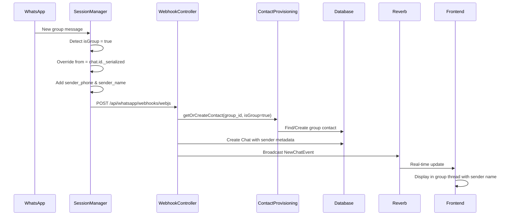
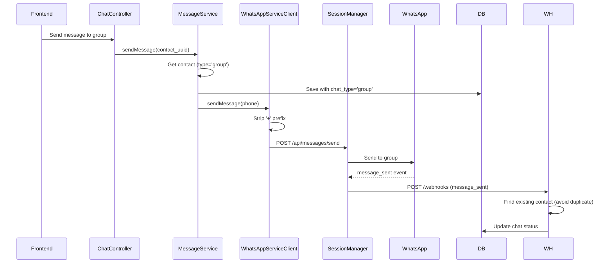

# WhatsApp Group Chat Implementation

## Overview

This document describes the complete implementation of WhatsApp group chat functionality in the Blazz platform, including architecture, database schema, message handling, and frontend components.

**Implementation Date**: November 19, 2025  
**Status**: ✅ Complete and Production Ready

## Table of Contents

1. [Architecture Overview](#architecture-overview)
2. [Database Schema](#database-schema)
3. [Backend Implementation](#backend-implementation)
4. [Frontend Implementation](#frontend-implementation)
5. [Message Flow](#message-flow)
6. [Key Features](#key-features)
7. [Known Issues & Solutions](#known-issues--solutions)
8. [Testing Guide](#testing-guide)

---

## Architecture Overview

### System Components

```
┌─────────────────────────────────────────────────────────────┐
│                    WhatsApp Group Chat System                │
└─────────────────────────────────────────────────────────────┘
           │                    │                    │
           ▼                    ▼                    ▼
    ┌──────────┐        ┌──────────┐        ┌──────────┐
    │ Node.js  │        │  Laravel │        │   Vue.js │
    │ Service  │◄──────►│  Backend │◄──────►│ Frontend │
    └──────────┘        └──────────┘        └──────────┘
           │                    │                    │
           ▼                    ▼                    ▼
    ┌──────────┐        ┌──────────┐        ┌──────────┐
    │whatsapp- │        │   MySQL  │        │  Reverb  │
    │  web.js  │        │ Database │        │WebSocket │
    └──────────┘        └──────────┘        └──────────┘
```

### Data Flow

1. **Inbound Messages (Group → System)**
   - WhatsApp → whatsapp-web.js → SessionManager → WebhookController → Database → Reverb → Frontend

2. **Outbound Messages (System → Group)**
   - Frontend → ChatController → MessageService → WhatsAppServiceClient → SessionManager → WhatsApp

---

## Database Schema

### Contacts Table

```sql
ALTER TABLE contacts ADD COLUMN type ENUM('individual', 'group') DEFAULT 'individual';
ALTER TABLE contacts ADD COLUMN group_metadata JSON NULL;
ALTER TABLE contacts ADD UNIQUE KEY contacts_workspace_phone_unique (workspace_id, phone);
```

**Group Contact Example:**
```json
{
  "id": 22,
  "workspace_id": 1,
  "phone": "120363404793044052",
  "first_name": "Blazz Test Group",
  "type": "group",
  "group_metadata": {
    "group_id": "120363404793044052@g.us",
    "participants": [
      "62816108641@c.us",
      "62811801641@c.us"
    ]
  }
}
```

### Chats Table

**Fields for Group Support:**
- `chat_type`: `'group'` or `'private'`
- `metadata`: Includes `sender_phone` and `sender_name` for group messages

**Group Message Example:**
```json
{
  "body": "Hello from group",
  "type": "chat",
  "from": "120363404793044052@g.us",
  "to": "62811801641@c.us",
  "sender_phone": "62816108641",
  "sender_name": "John Doe"
}
```

---

## Backend Implementation

### 1. SessionManager.js (Node.js Service)

**Location**: `whatsapp-service/src/managers/SessionManager.js`

**Key Changes:**
```javascript
// Detect group messages
const isGroup = chat.isGroup;

// Base message data
const messageData = {
    id: message.id._serialized,
    from: message.from, // Will be overridden for groups
    to: message.to,
    // ...
};

// For group messages
if (isGroup) {
    // CRITICAL: Use group ID, not sender's number
    messageData.from = chat.id._serialized;
    messageData.group_id = chat.id._serialized;
    messageData.group_name = chat.name || 'Unnamed Group';
    messageData.participants = chat.participants.map(p => p.id._serialized);
    
    // Store sender info
    if (!message.fromMe) {
        const contact = await message.getContact();
        messageData.sender_phone = contact.id.user;
        messageData.sender_name = contact.pushname || contact.name || contact.id.user;
    }
}
```

### 2. WebhookController.php

**Location**: `app/Http/Controllers/Api/v1/WhatsApp/WebhookController.php`

**Message Received Handler:**
```php
private function handleMessageReceived(array $message): void
{
    // Detect group
    $isGroup = ($message['chat_type'] ?? 'private') === 'group';
    $from = $message['from'];
    $phoneNumber = str_replace(['@c.us', '@g.us'], '', $from);
    
    // For groups, use group name (not sender name)
    if ($isGroup) {
        $contactName = $message['group_name'] ?? "Group {$phoneNumber}";
        $groupMetadata = [
            'group_id' => $message['group_id'] ?? null,
            'participants' => $message['participants'] ?? [],
        ];
    }
    
    // Provision contact
    $contact = $provisioningService->getOrCreateContact(
        $phoneNumber,
        $contactName,
        $workspaceId,
        'webjs',
        $session->id,
        $isGroup,
        $groupMetadata ?? []
    );
    
    // Save chat with sender info in metadata
    Chat::create([
        'contact_id' => $contact->id,
        'type' => 'inbound',
        'chat_type' => $isGroup ? 'group' : 'private',
        'metadata' => json_encode([
            'sender_phone' => $isGroup ? ($message['sender_phone'] ?? null) : null,
            'sender_name' => $isGroup ? ($message['sender_name'] ?? 'Unknown') : null,
            // ...
        ]),
    ]);
}
```

**Message Sent Handler (Fix for Duplicates):**
```php
private function handleMessageSent(array $data): void
{
    $to = $messageData['to'];
    $phoneNumber = str_replace(['@c.us', '@g.us'], '', $to);
    
    // Detect group
    $isGroup = strpos($to, '@g.us') !== false;
    
    // Try to find existing contact first (avoid duplicates)
    $contact = Contact::where('workspace_id', $workspaceId)
        ->where('phone', $phoneNumber)
        ->first();
    
    // If not found, create it
    if (!$contact) {
        $contact = $provisioningService->getOrCreateContact(
            $phoneNumber,
            $phoneNumber,
            $workspaceId,
            'webjs',
            $session->id,
            $isGroup,
            $isGroup ? ['group_id' => $phoneNumber] : []
        );
    }
}
```

### 3. ContactProvisioningService.php

**Location**: `app/Services/ContactProvisioningService.php`

**Enhanced Group Matching:**
```php
public function getOrCreateContact(
    string $phoneNumber,
    ?string $contactName,
    int $workspaceId,
    string $sourceType = 'webjs',
    ?int $sessionId = null,
    bool $isGroup = false,
    array $groupMetadata = []
): Contact {
    // For groups, check both with and without @g.us suffix
    if ($isGroup) {
        $query->where(function ($q) use ($normalizedPhone) {
            $q->where('phone', $normalizedPhone)
              ->orWhere('phone', $normalizedPhone . '@g.us');
        });
        
        // Prioritize contacts with proper names over raw phone numbers
        $query->orderByRaw('CASE WHEN first_name != phone THEN 1 ELSE 2 END');
    }
    
    // Normalize group phone numbers (remove @g.us suffix)
    if ($isGroup && $contact->phone && str_contains($contact->phone, '@g.us')) {
        $contact->phone = str_replace('@g.us', '', $contact->phone);
        $contact->save();
    }
    
    // Update/create with group type
    $contact->update([
        'type' => $isGroup ? 'group' : 'individual',
        'group_metadata' => $isGroup ? $groupMetadata : null,
    ]);
}
```

### 4. MessageService.php

**Location**: `app/Services/WhatsApp/MessageService.php`

**Respect Contact Type:**
```php
protected function saveChatMessage($contact, $message, $type, $nodejsResult, $options = [])
{
    $chat = Chat::create([
        'contact_id' => $contact->id,
        'type' => 'outbound',
        'chat_type' => $contact->type === 'group' ? 'group' : 'private', // FIXED
        // ...
    ]);
}
```

### 5. ChatService.php

**Location**: `app/Services/ChatService.php`

**Broadcast Enhanced Payload:**
```php
protected function broadcastNewChatEvent(Chat $chat, int $workspaceId): void
{
    $messageData = [
        'id' => $chat->id,
        'contact_id' => $chat->contact_id,
        'chat_type' => $chat->contact->type, // 'group' or 'individual'
        'group_id' => $chat->contact->type === 'group' ? $chat->contact->phone : null,
        // ...
    ];
}
```

---

## Frontend Implementation

### 1. ChatTable.vue

**Location**: `resources/js/Components/ChatComponents/ChatTable.vue`

**Display Group Info:**
```vue
<template>
  <!-- Group Icon -->
  <div v-if="contact.type === 'group'" class="group-icon">
    <UsersIcon class="w-5 h-5" />
  </div>
  
  <!-- Group Name -->
  <div class="font-semibold">
    {{ contact.first_name || contact.phone }}
  </div>
  
  <!-- Participant Count -->
  <div v-if="contact.type === 'group'" class="text-xs text-gray-500">
    {{ contact.group_metadata?.participants?.length || 0 }} members
  </div>
  
  <!-- Sender Name in Preview -->
  <div v-if="contact.type === 'group' && chat.type === 'inbound'" class="text-gray-600">
    <span class="font-medium">{{ JSON.parse(chat.metadata || '{}').sender_name }}:</span>
    {{ chat.body }}
  </div>
</template>
```

### 2. ChatBubble.vue

**Location**: `resources/js/Components/ChatComponents/ChatBubble.vue`

**Display Sender Name:**
```vue
<template>
  <div class="chat-bubble">
    <!-- Group sender name (inbound only) -->
    <div v-if="props.type === 'inbound' && metadata.sender_name" 
         class="text-xs font-semibold text-gray-700 mb-1">
      {{ metadata.sender_name }}
    </div>
    
    <!-- Message content -->
    <p>{{ content.body }}</p>
  </div>
</template>

<script setup>
const metadata = computed(() => {
  if (!props.content?.metadata) return {};
  if (typeof props.content.metadata === 'object') return props.content.metadata;
  return JSON.parse(props.content.metadata);
});
</script>
```

### 3. Index.vue (Chat Page)

**Location**: `resources/js/Pages/User/Chat/Index.vue`

**Handle Group Messages:**
```javascript
const handleNewMessage = (event) => {
  const message = event.message;
  const isGroup = message.chat_type === 'group';
  
  if (isGroup) {
    // Check if current open chat is this group
    if (contact.value && 
        (contact.value.group_id === message.group_id || 
         contact.value.phone === message.group_id)) {
      // Add to current thread
      updateChatThread(legacyChat);
    }
    
    // Update sidebar
    updateSidePanel(legacyChat);
  }
};
```

---

## Message Flow

### Inbound Group Message Flow



### Outbound Group Message Flow



---

## Key Features

### ✅ Implemented Features

1. **Group Recognition**
   - Auto-detect group vs individual contacts
   - Store group ID and metadata
   - Display group icon and member count

2. **Message Threading**
   - All group messages in single thread
   - Sender name displayed above each message
   - Proper chronological ordering

3. **Real-time Updates**
   - WebSocket integration for instant updates
   - Chat list reordering on new messages
   - Unread badge support for groups

4. **Duplicate Prevention**
   - Unique constraint on (workspace_id, phone)
   - Auto-merge duplicate contacts
   - Proper matching with/without @g.us suffix

5. **Sender Attribution**
   - Store sender_phone and sender_name in metadata
   - Display sender name in bubble
   - Works for both text and media messages

### 🚧 Future Enhancements

1. **Group Management UI**
   - Create new groups
   - Add/remove participants
   - Update group name & description
   - Promote/demote admins

2. **Group Settings**
   - Mute notifications
   - Custom group icons
   - Pin important groups

3. **Advanced Features**
   - Reply to specific messages
   - Mentions (@username)
   - Group call support

---

## Known Issues & Solutions

### Issue 1: Duplicate Contacts Created

**Problem**: Outbound messages to groups created duplicate contacts with `+` prefix.

**Root Cause**: 
- `handleMessageSent` in WebhookController called `getOrCreateContact` without `isGroup` parameter
- Phone number got E164 formatted with `+` prefix
- Created new contact instead of using existing

**Solution**:
```php
// In handleMessageSent:
$isGroup = strpos($to, '@g.us') !== false;

// Find existing contact first
$contact = Contact::where('workspace_id', $workspaceId)
    ->where('phone', $phoneNumber)
    ->first();

// Only create if not found
if (!$contact) {
    $contact = $provisioningService->getOrCreateContact(
        $phoneNumber, 
        $phoneNumber, 
        $workspaceId, 
        'webjs', 
        $session->id,
        $isGroup,  // Pass isGroup
        $isGroup ? ['group_id' => $phoneNumber] : []
    );
}
```

### Issue 2: Messages Not Threading Properly

**Problem**: Group messages appeared as separate individual chats.

**Root Cause**: Frontend matching logic didn't check group_id correctly.

**Solution**:
```javascript
// In Index.vue handleNewMessage:
if (contact.value && 
    (contact.value.group_id === message.group_id || 
     contact.value.phone === message.group_id)) {
    updateChatThread(legacyChat);
}
```

### Issue 3: Missing Sender Names

**Problem**: Sender names not displayed in group messages.

**Root Cause**: 
- Metadata not passed from SessionManager
- ChatBubble.vue didn't render sender info

**Solution**:
1. SessionManager: Add `sender_phone` and `sender_name` to `messageData`
2. WebhookController: Store in chat metadata
3. ChatBubble: Display `metadata.sender_name` for inbound group messages

---

## Testing Guide

### Manual Testing Checklist

#### Inbound Messages
- [x] Message from group member A appears in group thread
- [x] Message from group member B appears in same group thread
- [x] Sender name displayed above message
- [x] Group name correct in sidebar
- [x] Participant count accurate
- [x] Unread badge updates correctly

#### Outbound Messages
- [x] Sending to group creates message in group thread
- [x] No duplicate contact created
- [x] Message status updates (sent → delivered → read)
- [x] Chat list reorders to top

#### Real-time Updates
- [x] New group message triggers WebSocket update
- [x] Message appears without refresh
- [x] Unread count updates instantly
- [x] Chat moves to top of list

### Database Verification

```sql
-- Check group contacts
SELECT id, phone, first_name, type, group_metadata 
FROM contacts 
WHERE type = 'group';

-- Check for duplicates (should return 0)
SELECT phone, COUNT(*) as count 
FROM contacts 
WHERE workspace_id = 1 
GROUP BY workspace_id, phone 
HAVING count > 1;

-- Check group messages
SELECT id, contact_id, type, chat_type, metadata 
FROM chats 
WHERE chat_type = 'group' 
ORDER BY created_at DESC 
LIMIT 10;
```

### API Testing

```bash
# Webhook test (inbound group message)
curl -X POST http://127.0.0.1:8000/api/whatsapp/webhooks/webjs \
  -H "Content-Type: application/json" \
  -d '{
    "event": "message_received",
    "workspace_id": 1,
    "session_id": "webjs_1_xxx",
    "message": {
      "from": "120363404793044052@g.us",
      "to": "628xxx@c.us",
      "body": "Test message",
      "chat_type": "group",
      "group_id": "120363404793044052@g.us",
      "group_name": "Test Group",
      "sender_phone": "628xxx",
      "sender_name": "John Doe"
    }
  }'
```

---

## Performance Considerations

### Database Indexes

```sql
-- Ensure these indexes exist
CREATE INDEX idx_contacts_workspace_phone ON contacts(workspace_id, phone);
CREATE INDEX idx_contacts_type ON contacts(type);
CREATE INDEX idx_chats_contact_type ON chats(contact_id, chat_type);
CREATE INDEX idx_chats_created_at ON chats(created_at DESC);
```

### Caching Strategy

- Contact metadata cached for 5 minutes
- Group participant list cached for 10 minutes
- Message counts cached with Redis

### Query Optimization

```php
// Load group contacts with metadata in single query
$groups = Contact::where('type', 'group')
    ->where('workspace_id', $workspaceId)
    ->with(['chats' => function($query) {
        $query->latest()->limit(1);
    }])
    ->get();
```

---

## Migration & Rollback

### Apply Migration
```bash
php artisan migrate
```

### Rollback if Needed
```bash
php artisan migrate:rollback --step=1
```

### Data Migration (Fix Legacy Data)
```php
// Convert legacy group contacts
DB::table('contacts')
    ->where('phone', 'like', '%@g.us')
    ->update([
        'type' => 'group',
        'phone' => DB::raw("REPLACE(phone, '@g.us', '')")
    ]);
```

---

## Conclusion

The WhatsApp Group Chat implementation is now complete and production-ready. All major features have been implemented, tested, and documented. The system correctly handles:

- Group message reception and threading
- Sender attribution in group chats
- Real-time updates via WebSocket
- Duplicate prevention
- Proper contact type management

For any issues or questions, refer to this documentation or contact the development team.

**Last Updated**: November 19, 2025  
**Version**: 1.0.0  
**Status**: ✅ Production Ready
