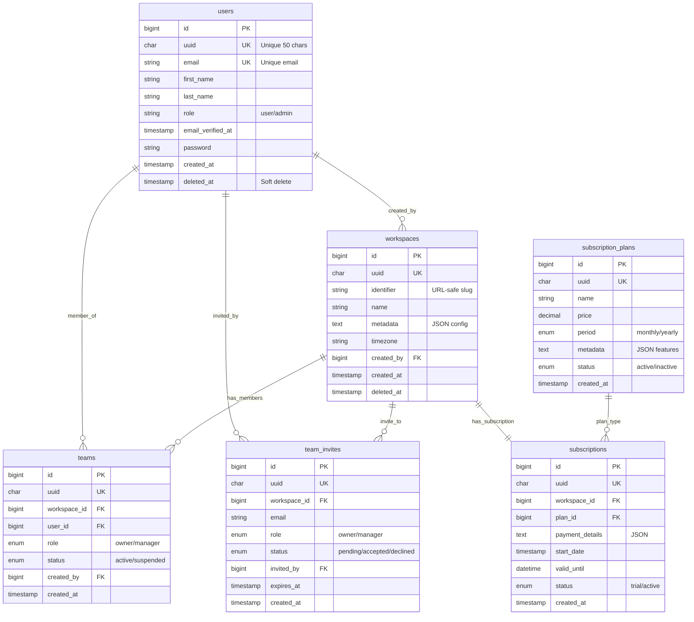
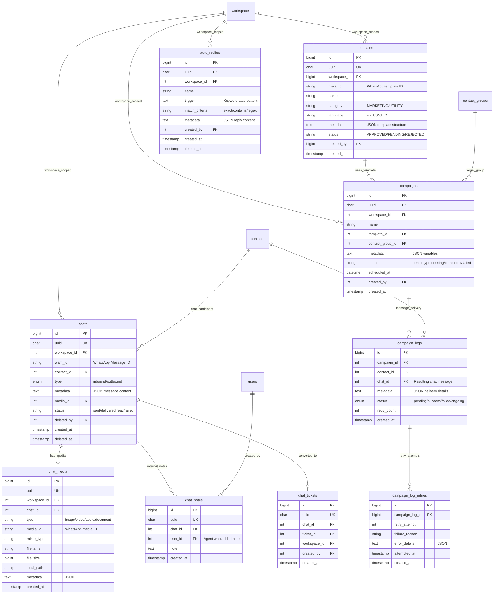
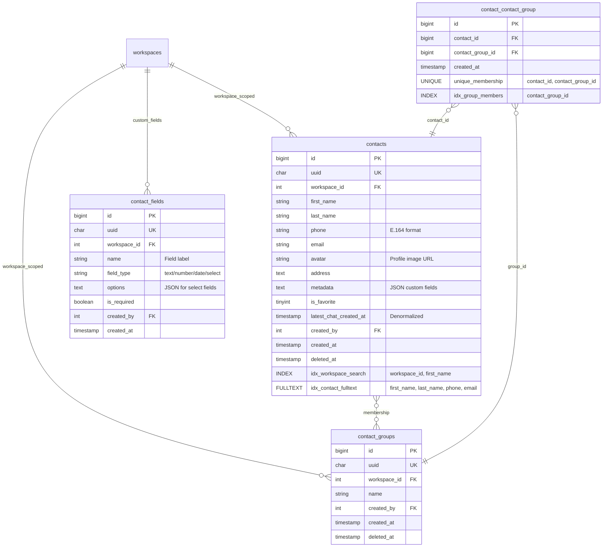
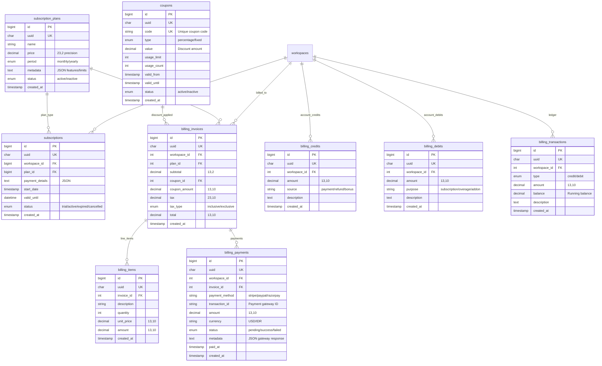
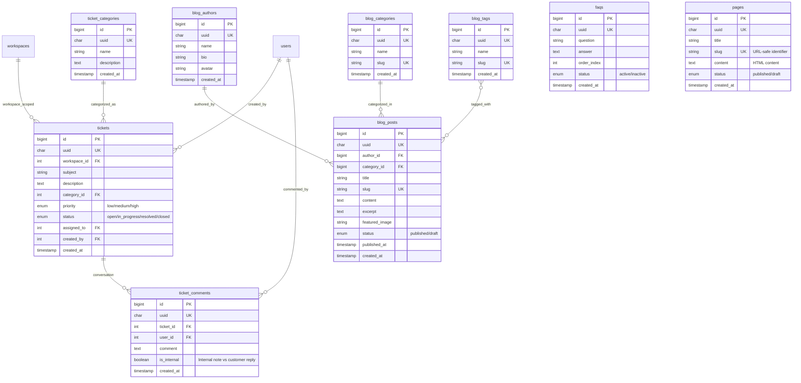
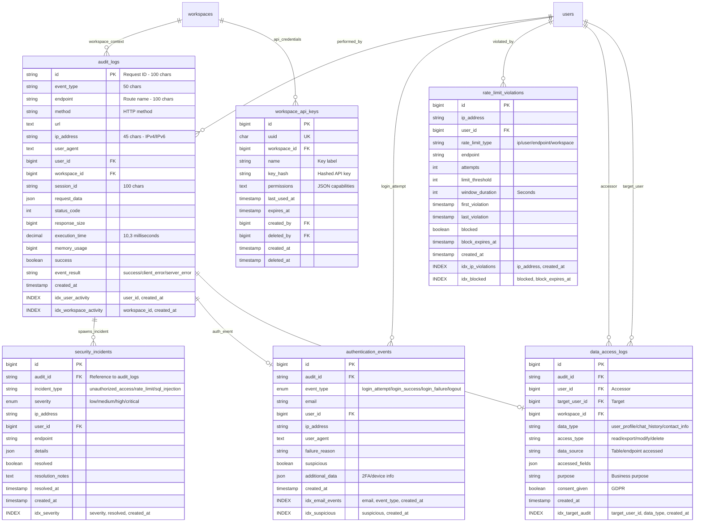
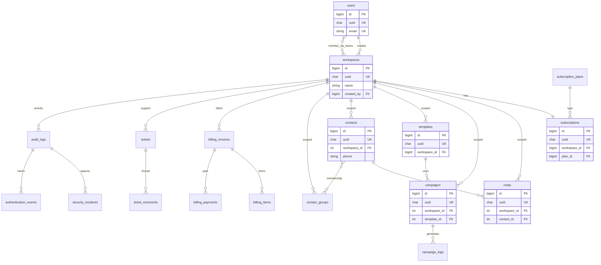

# Entity Relationship Design - Blazz Database

> **Complete ERD Documentation dengan Mermaid Diagrams**  
> **Database Version:** MySQL 8.0+  
> **Total Tables:** 60+ tables

---

## 📋 TABLE OF CONTENTS

1. [Entity Overview](#entity-overview)
2. [Core Domain - User & Workspace Management](#core-domain)
3. [Messaging Domain - Chats & Campaigns](#messaging-domain)
4. [Contact Management Domain](#contact-management-domain)
5. [Billing & Subscription Domain](#billing-domain)
6. [Support & CMS Domain](#support-domain)
7. [Security & Audit Domain](#security-domain)
8. [Complete ERD Diagram](#complete-erd)

---

## 📊 ENTITY OVERVIEW

### Table Classification by Domain

```
CORE DOMAIN (User & Workspace Management)
├── users (Central user authentication & profile)
├── workspaces (Tenant/organization isolation)
├── teams (User-workspace membership with roles)
├── team_invites (Pending workspace invitations)
└── roles (System-wide role definitions)

MESSAGING DOMAIN (WhatsApp Communication)
├── chats (Individual messages - 10M+ records)
├── chat_media (Media attachments - images/videos/documents)
├── chat_notes (Internal agent notes on conversations)
├── chat_tickets (Chat-to-support ticket conversion)
├── chat_ticket_logs (Ticket activity history)
├── templates (WhatsApp approved message templates)
├── campaigns (Bulk messaging campaigns)
├── campaign_logs (Individual campaign message delivery - 25M+ records)
├── campaign_log_retries (Failed message retry tracking)
└── auto_replies (Automated response rules)

CONTACT MANAGEMENT DOMAIN
├── contacts (Customer/contact database - 1.5M+ records)
├── contact_groups (Segmentation groups)
├── contact_contact_group (Many-to-many junction table)
└── contact_fields (Custom field definitions)

BILLING & SUBSCRIPTION DOMAIN
├── subscription_plans (Available pricing plans)
├── subscriptions (Workspace subscription status)
├── billing_invoices (Invoice generation)
├── billing_items (Invoice line items)
├── billing_payments (Payment records)
├── billing_credits (Account credits)
├── billing_debits (Account debits)
├── billing_transactions (Transaction ledger)
├── billing_tax_rates (Tax calculation rules)
├── coupons (Discount codes)
└── payment_gateways (Payment processor config)

SUPPORT & CMS DOMAIN
├── tickets (Customer support tickets)
├── ticket_comments (Ticket conversation threads)
├── ticket_categories (Support categorization)
├── faqs (Knowledge base articles)
├── pages (CMS pages - About, Terms, etc.)
├── blog_posts (Blog content)
├── blog_authors (Blog author profiles)
├── blog_categories (Blog organization)
├── blog_tags (Blog taxonomy)
└── reviews (Customer testimonials)

SECURITY & AUDIT DOMAIN
├── audit_logs (Comprehensive activity tracking)
├── security_incidents (Security event monitoring)
├── authentication_events (Login/logout/failure tracking)
├── rate_limit_violations (API throttling violations)
├── data_access_logs (GDPR compliance tracking)
└── workspace_api_keys (API authentication tokens)

SYSTEM DOMAIN
├── jobs (Background queue jobs)
├── failed_jobs (Failed job records)
├── job_batches (Batch job tracking)
├── notifications (User notification queue)
├── email_logs (Email sending history)
├── email_templates (Transactional email templates)
├── modules (Plugin/extension registry)
├── addons (Marketplace addons)
├── languages (Multi-language support)
├── settings (System configuration)
├── documents (File storage metadata)
├── password_reset_tokens (Password reset verification)
└── seeder_histories (Migration seeder tracking)
```

---

## 🔐 CORE DOMAIN - User & Workspace Management

### Entity Relationship Summary

```
users (1) ──────< (N) teams (N) >────── (1) workspaces
  │                                           │
  │ created_by                     created_by │
  └──────< (N) workspaces ────────────────────┘
  
  │                                           
  └──────< (N) team_invites
```

**Relationships:**
- **users → workspaces**: 1:N (One user can CREATE many workspaces)
- **users ↔ workspaces**: N:M through `teams` (Users can be members of multiple workspaces)
- **workspaces → teams**: 1:N (One workspace has many team members)
- **users → team_invites**: 1:N (One user can invite many people)

### ERD Diagram: Core Domain



### Key Relationships Explained

#### 1. **User-Workspace Relationship (Creator)**

```sql
-- One user can CREATE multiple workspaces
SELECT w.* FROM workspaces w
WHERE w.created_by = 42;  -- All workspaces created by user #42
```

**Cardinality:** 1:N (One-to-Many)  
**Foreign Key:** `workspaces.created_by → users.id`

#### 2. **User-Workspace Relationship (Membership)**

```sql
-- One user can be MEMBER of multiple workspaces through teams table
SELECT w.* FROM workspaces w
INNER JOIN teams t ON t.workspace_id = w.id
WHERE t.user_id = 42 AND t.status = 'active';
```

**Cardinality:** N:M (Many-to-Many)  
**Junction Table:** `teams`  
**Additional Attributes:** role (owner/manager), status (active/suspended)

#### 3. **Workspace-Subscription Relationship**

```sql
-- One workspace has ONE active subscription
SELECT s.* FROM subscriptions s
WHERE s.workspace_id = 123
ORDER BY s.created_at DESC
LIMIT 1;  -- Latest subscription
```

**Cardinality:** 1:1 (One-to-One - logically, though physically 1:N for history)  
**Foreign Key:** `subscriptions.workspace_id → workspaces.id`

---

## 💬 MESSAGING DOMAIN - Chats & Campaigns

### Entity Relationship Summary

```
workspaces (1) ──────< (N) chats
                             │
                             ├──────< (N) chat_media
                             ├──────< (N) chat_notes
                             └──────< (N) chat_tickets
                             
workspaces (1) ──────< (N) campaigns
                             │
                             └──────< (N) campaign_logs
                                          │
                                          └──────< (N) campaign_log_retries

workspaces (1) ──────< (N) templates
workspaces (1) ──────< (N) auto_replies
```

**Relationships:**
- **workspaces → chats**: 1:N (Workspace-scoped chat messages)
- **chats → chat_media**: 1:1 (One chat can have one media attachment)
- **chats → contacts**: N:1 (Many chats belong to one contact)
- **campaigns → campaign_logs**: 1:N (One campaign generates many message logs)
- **campaign_logs → campaign_log_retries**: 1:N (Failed logs can have retry attempts)

### ERD Diagram: Messaging Domain



### Key Relationships Explained

#### 1. **Chat-Contact Relationship**

```sql
-- Get all chats for a specific contact
SELECT c.* FROM chats c
WHERE c.contact_id = 789
  AND c.workspace_id = 123
ORDER BY c.created_at DESC;
```

**Cardinality:** N:1 (Many-to-One)  
**Logic:** One contact can have many chat messages over time.

#### 2. **Campaign-Template-ContactGroup Relationship**

```sql
-- Campaign references both template and target contact group
SELECT 
    c.name AS campaign_name,
    t.name AS template_name,
    cg.name AS target_group
FROM campaigns c
INNER JOIN templates t ON c.template_id = t.id
INNER JOIN contact_groups cg ON c.contact_group_id = cg.id
WHERE c.workspace_id = 123;
```

**Cardinality:** Campaign N:1 Template, Campaign N:1 ContactGroup

#### 3. **Campaign Execution Flow**

```sql
-- Campaign creates multiple campaign_logs (one per contact)
SELECT 
    cl.contact_id,
    cl.status,
    cl.retry_count,
    COUNT(clr.id) AS total_retries
FROM campaign_logs cl
LEFT JOIN campaign_log_retries clr ON clr.campaign_log_id = cl.id
WHERE cl.campaign_id = 456
GROUP BY cl.id;
```

**Flow:**
1. Campaign created with template + contact_group
2. Job generates campaign_logs for each contact in group
3. Each log tracks delivery status
4. Failed logs spawn campaign_log_retries

---

## 👥 CONTACT MANAGEMENT DOMAIN

### Entity Relationship Summary

```
workspaces (1) ──────< (N) contacts
workspaces (1) ──────< (N) contact_groups
contacts (N) ──────< (M) contact_groups  [via contact_contact_group]
workspaces (1) ──────< (N) contact_fields
```

**Relationships:**
- **workspaces → contacts**: 1:N (Workspace-scoped contacts)
- **workspaces → contact_groups**: 1:N (Workspace-scoped groups)
- **contacts ↔ contact_groups**: N:M (Contacts can be in multiple groups)

### ERD Diagram: Contact Management



### Key Relationships Explained

#### 1. **Many-to-Many Contact-Group Relationship**

```sql
-- Get all contacts in a specific group
SELECT c.* FROM contacts c
INNER JOIN contact_contact_group ccg ON ccg.contact_id = c.id
WHERE ccg.contact_group_id = 10
  AND c.workspace_id = 123
  AND c.deleted_at IS NULL;

-- Get all groups a contact belongs to
SELECT cg.* FROM contact_groups cg
INNER JOIN contact_contact_group ccg ON ccg.contact_group_id = cg.id
WHERE ccg.contact_id = 500
  AND cg.workspace_id = 123;
```

**Junction Table:** `contact_contact_group`  
**Constraints:** UNIQUE (contact_id, contact_group_id) - prevents duplicate memberships

#### 2. **Contact Search with Full-Text Index**

```sql
-- Full-text search across multiple fields
SELECT * FROM contacts
WHERE workspace_id = 123
  AND MATCH(first_name, last_name, phone, email) 
      AGAINST('john +62812' IN BOOLEAN MODE)
  AND deleted_at IS NULL;
```

**Index:** FULLTEXT `idx_contact_fulltext` on (first_name, last_name, phone, email)

---

## 💳 BILLING & SUBSCRIPTION DOMAIN

### Entity Relationship Summary

```
workspaces (1) ──────< (N) subscriptions ────── (N:1) subscription_plans
workspaces (1) ──────< (N) billing_invoices
billing_invoices (1) ──────< (N) billing_items
billing_invoices (1) ──────< (N) billing_payments
workspaces (1) ──────< (N) billing_credits
workspaces (1) ──────< (N) billing_debits
workspaces (1) ──────< (N) billing_transactions
```

### ERD Diagram: Billing Domain



### Key Relationships Explained

#### 1. **Subscription Lifecycle**

```sql
-- Current active subscription
SELECT s.*, sp.name AS plan_name
FROM subscriptions s
INNER JOIN subscription_plans sp ON s.plan_id = sp.id
WHERE s.workspace_id = 123
  AND s.status = 'active'
  AND s.valid_until > NOW()
ORDER BY s.created_at DESC
LIMIT 1;
```

#### 2. **Invoice Generation Flow**

```sql
-- Create invoice with items and payments
INSERT INTO billing_invoices (uuid, workspace_id, plan_id, subtotal, total, ...)
VALUES (...);

INSERT INTO billing_items (invoice_id, description, quantity, unit_price, amount)
VALUES (LAST_INSERT_ID(), 'Professional Plan - Monthly', 1, 49.00, 49.00);

-- Payment processing
INSERT INTO billing_payments (invoice_id, payment_method, amount, status, ...)
VALUES (LAST_INSERT_ID(), 'stripe', 49.00, 'success', ...);
```

#### 3. **Account Balance Tracking**

```sql
-- Credit/Debit tracking dengan running balance
SELECT 
    bt.type,
    bt.amount,
    bt.balance AS running_balance,
    bt.description,
    bt.created_at
FROM billing_transactions bt
WHERE bt.workspace_id = 123
ORDER BY bt.created_at DESC;

-- Current balance
SELECT balance FROM billing_transactions
WHERE workspace_id = 123
ORDER BY created_at DESC
LIMIT 1;
```

---

## 🎫 SUPPORT & CMS DOMAIN

### Entity Relationship Summary

```
workspaces (1) ──────< (N) tickets
tickets (1) ──────< (N) ticket_comments
ticket_categories (1) ──────< (N) tickets

System-wide (no workspace_id):
├── faqs
├── pages
├── blog_posts ────── blog_authors
├── blog_posts ────<> blog_categories
└── blog_posts ────<> blog_tags
```

### ERD Diagram: Support & CMS



---

## 🔒 SECURITY & AUDIT DOMAIN

### Entity Relationship Summary

```
audit_logs (1) ──────< (N) security_incidents
audit_logs (1) ──────< (N) authentication_events
audit_logs (1) ──────< (N) data_access_logs

workspaces (1) ──────< (N) workspace_api_keys
```

### ERD Diagram: Security & Audit



### Key Relationships Explained

#### 1. **Audit Log as Central Event Source**

```sql
-- Comprehensive activity tracking
SELECT 
    al.event_type,
    u.email,
    w.name AS workspace_name,
    al.endpoint,
    al.execution_time,
    al.created_at
FROM audit_logs al
LEFT JOIN users u ON al.user_id = u.id
LEFT JOIN workspaces w ON al.workspace_id = w.id
WHERE al.created_at >= NOW() - INTERVAL 1 DAY
ORDER BY al.created_at DESC;
```

#### 2. **Security Incident Detection**

```sql
-- High severity unresolved incidents
SELECT 
    si.*,
    al.endpoint,
    al.ip_address,
    u.email
FROM security_incidents si
INNER JOIN audit_logs al ON si.audit_id = al.id
LEFT JOIN users u ON si.user_id = u.id
WHERE si.severity IN ('high', 'critical')
  AND si.resolved = FALSE
ORDER BY si.created_at DESC;
```

#### 3. **GDPR Compliance - Data Access Tracking**

```sql
-- Who accessed what data about a specific user
SELECT 
    dal.access_type,
    dal.data_type,
    accessor.email AS accessed_by,
    dal.purpose,
    dal.consent_given,
    dal.created_at
FROM data_access_logs dal
INNER JOIN users accessor ON dal.user_id = accessor.id
WHERE dal.target_user_id = 789  -- Target user whose data was accessed
ORDER BY dal.created_at DESC;
```

---

## 📐 COMPLETE ERD DIAGRAM

### Full System ERD (Simplified View)



---

## 📊 RELATIONSHIP SUMMARY TABLE

| Entity 1 | Relationship | Entity 2 | Type | Junction Table | Notes |
|----------|--------------|----------|------|----------------|-------|
| users | creates | workspaces | 1:N | - | One user creates many workspaces |
| users | member_of | workspaces | N:M | teams | User can be member of multiple workspaces |
| workspaces | has | subscriptions | 1:1 | - | One active subscription per workspace |
| workspaces | contains | contacts | 1:N | - | Workspace-scoped contacts |
| workspaces | contains | chats | 1:N | - | Workspace-scoped chats |
| workspaces | contains | campaigns | 1:N | - | Workspace-scoped campaigns |
| contacts | participates_in | chats | 1:N | - | One contact has many chats |
| contacts | belongs_to | contact_groups | N:M | contact_contact_group | Contacts in multiple groups |
| campaigns | uses | templates | N:1 | - | Campaign references one template |
| campaigns | generates | campaign_logs | 1:N | - | One campaign creates many logs |
| campaign_logs | retries | campaign_log_retries | 1:N | - | Failed logs have retry attempts |
| chats | has | chat_media | 1:1 | - | One chat can have one media |
| chats | converts_to | chat_tickets | 1:1 | - | Chat can be converted to ticket |
| tickets | has | ticket_comments | 1:N | - | Ticket conversation thread |
| billing_invoices | contains | billing_items | 1:N | - | Invoice line items |
| billing_invoices | paid_by | billing_payments | 1:N | - | Multiple payments for one invoice |
| audit_logs | spawns | security_incidents | 1:N | - | Audit event creates incidents |
| blog_posts | authored_by | blog_authors | N:1 | - | Posts have one author |
| blog_posts | tagged_with | blog_tags | N:M | blog_post_tags | Posts have multiple tags |

---

## 🔑 FOREIGN KEY CONSTRAINTS

### Critical Foreign Keys with ON DELETE Behavior

```sql
-- CASCADE DELETE (Parent delete removes children)
ALTER TABLE subscriptions 
    ADD FOREIGN KEY (workspace_id) REFERENCES workspaces(id) ON DELETE CASCADE;

ALTER TABLE contact_contact_group 
    ADD FOREIGN KEY (contact_id) REFERENCES contacts(id) ON DELETE CASCADE;

-- RESTRICT (Prevent parent delete if children exist)
ALTER TABLE campaigns 
    ADD FOREIGN KEY (template_id) REFERENCES templates(id) ON DELETE RESTRICT;

-- SET NULL (Set to NULL on parent delete)
ALTER TABLE chats 
    ADD FOREIGN KEY (media_id) REFERENCES chat_media(id) ON DELETE SET NULL;
```

### Foreign Key Index Strategy

```sql
-- Every foreign key column has an index for performance
CREATE INDEX idx_chats_workspace ON chats(workspace_id);
CREATE INDEX idx_chats_contact ON chats(contact_id);
CREATE INDEX idx_campaigns_workspace ON campaigns(workspace_id);
CREATE INDEX idx_campaigns_template ON campaigns(template_id);
```

---

**Next Document:** [Complete Schema Structure →](./03-complete-schema-structure.md)
